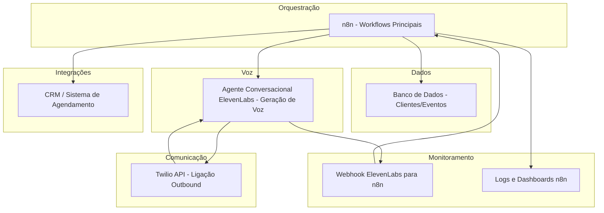

# 🏗️ Arquitetura
LUANA - Comunicação Automatizada com IA  
## Sumário
- [Visão de Componentes](#visão-de-componentes)  
- [Descrição dos Serviços](#descrição-dos-serviços)  
- [Diagrama de Componentes](#diagrama-de-componentes)

---

## Visão de Componentes

A arquitetura da **LUANA** é composta por camadas independentes e integradas que conectam automações do **n8n**, serviços de **voz IA da ElevenLabs** e **ligações outbound via Twilio**, além de integrações com bancos de dados e webhooks de retorno.

1. **Orquestração**: workflows n8n responsáveis pela execução sequencial dos processos e controle de erros.  
2. **Dados**: banco de dados (PostgreSQL) para consulta de clientes e eventos.  
3. **Geração de Voz**: Agente Conversacional ElevenLabs para liagações personalizados com base em dados vindos do fluxo principal do N8N.  
4. **Comunicação Telefônica**: Twilio API para ligações outbound automatizadas.  
5. **Monitoramento e Logs**: Webhooks e registros de execução no n8n para auditoria e análise.  
6. **Integrações Externas**: CRM para agendamento, fluxo N8N consumindo os resultados gerados.

---

## Descrição dos Serviços

- **n8n (Orquestração de Fluxos)**: coordena todos os workflows — desde a coleta de dados até o envio das ligações e tratamento de respostas.  
- **Banco de Dados (PostgreSQL)**: repositório de clientes, eventos e histórico de contatos.  
- **ElevenLabs API**: gera voz sintética a partir de texto e contexto do cliente.  
- **Twilio API**: executa chamadas outbound utilizando os áudios da ElevenLabs.  
- **Webhook Receiver (n8n)**: recebe dados e transcrições das chamadas finalizadas pela ElevenLabs.  
- **Logs e Monitoramento (n8n)**: registra status, tentativas, falhas e resultados de cada execução.  
- **CRM**: destino final para gravação de confirmações.

---

## Diagrama de Componentes

