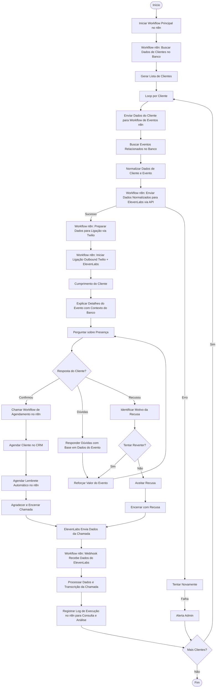

# 🔄 Fluxo de Dados
LUANA - Comunicação Automatizada com IA  
## Sumário
- [Sequência de Execução](#sequência-de-execução)  
- [Detalhamento das Etapas](#detalhamento-das-etapas)  
- [Diagrama de Sequência](#diagrama-de-sequência)

---

## Sequência de Execução

1. **Workflow Principal (n8n)**: inicia o processo e busca lista de clientes no banco.  
2. **Workflow de Eventos (n8n)**: consulta eventos associados a cada cliente.  
3. **Normalização de Dados**: estrutura e prepara os dados para envio à ElevenLabs.  
4. **Agente Conversacional ElevenLabs**: ligação personalizada baseado nas informações do cliente e evento.  
5. **Twilio API**: realiza chamada outbound utilizando Agente Conversacional ElevenLabs como voz e cérebro da conversa.  
6. **Interação do Cliente**: resposta (confirmação, dúvida ou recusa) é processada pela lógica condicional no cérebro do prompt do Agente Conversacional ElevenLabs.  
7. **Webhook ElevenLabs → n8n**: retorna dados, logs e transcrições da chamada.  
8. **Registro Final**: dados processados e enviados ao CRM.

---

## Detalhamento das Etapas

- **Workflow Principal (n8n)**: inicia a automação e executa o loop sobre os clientes extraídos do banco de dados.  
- **Workflow de Eventos**: busca eventos vinculados a cada cliente e consolida as informações.  
- **Normalização de Dados**: estrutura o payload (cliente + evento) para uso direto no prompt do Agente Conversacional ElevenLabs.  
- **Agente Conversacional ElevenLabs**: ligação personalizada baseado nas informações do cliente e evento. 
- **Twilio API**: realiza a ligação outbound e conecta com Agente Conversacional ElevenLabs.  
- **Interação do Cliente**: captura respostas e aplica decisões automatizadas (confirmar, esclarecer ou registrar recusa).  
- **Webhook ElevenLabs → n8n**: recebe as informações pós-chamada, incluindo transcrição e status da execução.  
- **Registro Final no CRM**: o n8n agenda cliente para evento.

---

## Diagrama de Sequência

