# 🔄 Fluxo de Dados
LUANA - Comunicação Automatizada com IA  
## Sumário
- [Sequência de Execução](#sequência-de-execução)  
- [Detalhamento das Etapas](#detalhamento-das-etapas)  
- [Diagrama de Sequência](#diagrama-de-sequência)

---

## Sequência de Execução

1. **Workflow Principal (n8n)**: inicia o processo e busca lista de clientes no banco.  
2. **Workflow de Eventos (n8n)**: consulta eventos associados a cada cliente.  
3. **Normalização de Dados**: estrutura e prepara os dados para envio à ElevenLabs.  
4. **Agente Conversacional ElevenLabs**: ligação personalizada baseado nas informações do cliente e evento.  
5. **Twilio API**: realiza chamada outbound utilizando Agente Conversacional ElevenLabs como voz e cérebro da conversa.  
6. **Interação do Cliente**: resposta (confirmação, dúvida ou recusa) é processada pela lógica condicional no cérebro do prompt do Agente Conversacional ElevenLabs.  
7. **Webhook ElevenLabs → n8n**: retorna dados, logs e transcrições da chamada.  
8. **Registro Final**: dados processados e enviados ao CRM.

---

## Detalhamento das Etapas

- **Workflow Principal (n8n)**: inicia a automação e executa o loop sobre os clientes extraídos do banco de dados.  
- **Workflow de Eventos**: busca eventos vinculados a cada cliente e consolida as informações.  
- **Normalização de Dados**: estrutura o payload (cliente + evento) para uso direto no prompt do Agente Conversacional ElevenLabs.  
- **Agente Conversacional ElevenLabs**: ligação personalizada baseado nas informações do cliente e evento. 
- **Twilio API**: realiza a ligação outbound e conecta com Agente Conversacional ElevenLabs.  
- **Interação do Cliente**: captura respostas e aplica decisões automatizadas (confirmar, esclarecer ou registrar recusa).  
- **Webhook ElevenLabs → n8n**: recebe as informações pós-chamada, incluindo transcrição e status da execução.  
- **Registro Final no CRM**: o n8n agenda cliente para evento.

---

## Diagrama de Sequência

```mermaid
graph TD
    %% INÍCIO DO PROCESSO PRINCIPAL
    Start([Início]) --> IniciarWorkflowN8N[Iniciar Workflow Principal no n8n]
    
    %% COLETA DE DADOS DO CLIENTE
    IniciarWorkflowN8N --> BuscarClientes[Workflow n8n: Buscar Dados de Clientes no Banco]
    BuscarClientes --> ListaClientes[Gerar Lista de Clientes]
    ListaClientes --> Loop[Loop por Cliente]
    
    %% OBTÉM EVENTOS RELACIONADOS AO CLIENTE
    Loop --> EnviarFluxoEventos[Enviar Dados do Cliente para Workflow de Eventos n8n]
    EnviarFluxoEventos --> BuscarEvento[Buscar Eventos Relacionados no Banco]
    BuscarEvento --> NormalizarDados[Normalizar Dados de Cliente e Evento]
    
    %% ENVIO PARA ELEVENLABS
    NormalizarDados --> EnviarElevenLabs[Workflow n8n: Enviar Dados Normalizados para ElevenLabs via API]
    EnviarElevenLabs -->|Sucesso| PrepararLigacao[Workflow n8n: Preparar Dados para Ligação via Twilio]
    EnviarElevenLabs -->|Erro| TentarNovamente[Tentar Novamente]
    TentarNovamente -->|Falha| AlertaAdmin[Alerta Admin]
    AlertaAdmin --> ProximoCliente
    
    %% CHAMADA OUTBOUND VIA TWILIO
    PrepararLigacao --> IniciarLigacao[Workflow n8n: Iniciar Ligação Outbound Twilio + ElevenLabs]
    IniciarLigacao --> Cumprimento[Cumprimento do Cliente]
    Cumprimento --> ExplicarEvento[Explicar Detalhes do Evento com Contexto do Banco]
    ExplicarEvento --> PerguntarConfirmacao[Perguntar sobre Presença]
    
    %% LÓGICA DE DECISÃO DURANTE A CHAMADA
    PerguntarConfirmacao --> Decisao{Resposta do Cliente?}
    
    Decisao -->|Confirmou| ChamarFluxoAgendamento[Chamar Workflow de Agendamento no n8n]
    ChamarFluxoAgendamento --> AgendarNoCRM[Agendar Cliente no CRM]
    AgendarNoCRM --> AgendarLembrete[Agendar Lembrete Automático no n8n]
    AgendarLembrete --> Agradecer[Agradecer e Encerrar Chamada]
    
    Decisao -->|Dúvidas| ResponderDuvidas[Responder Dúvidas com Base em Dados do Evento]
    ResponderDuvidas --> ReforcarValor[Reforçar Valor do Evento]
    ReforcarValor --> PerguntarConfirmacao
    
    Decisao -->|Recusou| IdentificarMotivo[Identificar Motivo da Recusa]
    IdentificarMotivo --> TentarReverter{Tentar Reverter?}
    TentarReverter -->|Sim| ReforcarValor
    TentarReverter -->|Não| AceitarRecusa[Aceitar Recusa]
    AceitarRecusa --> EncerrarNegativo[Encerrar com Recusa]
    
    %% PÓS-LIGAÇÃO E INTEGRAÇÃO
    Agradecer --> EnviarDadosChamada[ElevenLabs Envia Dados da Chamada]
    EncerrarNegativo --> EnviarDadosChamada
    
    EnviarDadosChamada --> WebhookElevenLabs[Workflow n8n: Webhook Recebe Dados do ElevenLabs]
    WebhookElevenLabs --> ProcessarDados[Processar Dados e Transcrição da Chamada]
    ProcessarDados --> RegistrarLog[Registrar Log de Execução no n8n para Consulta e Análise]
    
    %% LOOP DE CLIENTES
    RegistrarLog --> ProximoCliente{Mais Clientes?}
    ProximoCliente -->|Sim| Loop
    ProximoCliente -->|Não| Fim([Fim])
```

